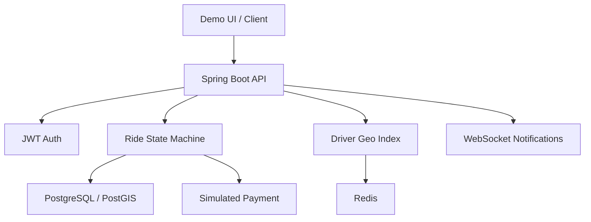

# RideFlow

RideFlow is a simplified Java/Spring Boot ride-hailing backend inspired by Uber. The first milestone focuses on:

- JWT-based rider and driver authentication
- Driver online/offline status and live location updates
- Redis-backed nearest-driver lookup
- Ride request flow with a strict ride state machine
- Concurrency-safe ride acceptance with database locking
- Trip start and completion with pricing and simulated payment
- WebSocket/STOMP ride updates and driver offer notifications
- A built-in rider/driver demo UI served from `/`

## Stack

- Java 21
- Spring Boot 3.5
- PostgreSQL + PostGIS
- Redis
- Flyway
- Spring Security + JWT
- Spring WebSocket/STOMP
- OpenAPI via Springdoc

## Run locally

1. Start infrastructure:

```bash
docker compose up -d
```

2. Start the application:

```bash
mvn spring-boot:run
```

The default local credentials are configured in [application.yml](/Users/huseynbva/RideFlow/src/main/resources/application.yml).

3. Open the demo UI:

```text
http://localhost:8080/
```

## Key API endpoints

- `POST /auth/register`
- `POST /auth/login`
- `POST /drivers/me/online`
- `POST /drivers/me/offline`
- `POST /drivers/me/location`
- `GET /drivers/nearby`
- `POST /rides/request`
- `POST /rides/{rideId}/accept`
- `POST /rides/{rideId}/start`
- `POST /rides/{rideId}/complete`
- `GET /rides/{rideId}`
- `GET /riders/me/rides`
- `GET /drivers/me/rides`

## WebSocket topics

- `/topic/rides/{rideId}`
- `/topic/drivers/{driverId}/offers`
- `/topic/riders/{riderId}`

## Demo flow

1. Register one rider and one or more drivers.
2. Put drivers online and push driver locations.
3. Request a ride as the rider.
4. Observe the candidate driver offer topic.
5. Accept the ride as a driver.
6. Start and complete the ride as the assigned driver.

## Process Flow

```mermaid
flowchart LR
    A["Rider registers / logs in"] --> B["Driver registers / logs in"]
    B --> C["Driver updates location"]
    C --> D["Driver goes online"]
    D --> E["Rider requests ride"]
    E --> F["Backend finds nearby available drivers"]
    F --> G["Driver accepts ride"]
    G --> H["Ride state = DRIVER_ASSIGNED"]
    H --> I["Driver starts trip"]
    I --> J["Ride state = IN_PROGRESS"]
    J --> K["Driver completes trip"]
    K --> L["Fare calculated and payment simulated"]
    L --> M["Ride state = COMPLETED"]
```



## System View



## Fare Calculation

RideFlow uses a simple but explicit fare policy that is close to how a ride-hailing MVP should behave.

The configured formula is:

```text
fare = max(
  minimum_fare,
  base_fare
  + booking_fee
  + (billable_distance_km * per_km_rate)
  + (billable_duration_min * per_minute_rate)
)
```

The values are configured in [application.yml](/Users/huseynbva/RideFlow/src/main/resources/application.yml) under `app.pricing`.

### How distance is calculated

- The backend first computes straight-line distance between pickup and dropoff using the Haversine formula.
- That direct distance is then multiplied by `route-distance-multiplier`.
- This multiplier is intentional. Straight-line distance underestimates a real road trip, so the multiplier makes the estimate more realistic without calling an external routing provider.
- The adjusted result becomes the billable distance.

### How duration is calculated

- Estimated fare uses the billable distance and `estimated-average-speed-kph` to infer trip time.
- Estimated duration is rounded up and never goes below `minimum-estimated-duration-minutes`.
- Final fare uses actual trip time if the ride was started.
- Actual trip duration is measured from `startedAt` to completion time, rounded up to the next minute, and never goes below `minimum-final-duration-minutes`.
- If a ride is completed without a `startedAt` timestamp, the system falls back to the estimated duration path.

### Why this design is useful

- The fare policy is deterministic and easy to explain in an interview.
- It avoids undercharging on very short trips because of the minimum fare floor.
- It avoids underestimating real road distance while still staying backend-only.
- It keeps pricing logic centralized in [PricingService.java](/Users/huseynbva/RideFlow/src/main/java/com/rideflow/uberclone/pricing/service/PricingService.java), so ride controllers and state transitions do not embed pricing rules.

## Geo Matching Logic

The driver-rider matching path separates fast-changing location data from transactional ride state.

### Driver location lifecycle

- A driver sends location updates through `POST /drivers/me/location`.
- The latest latitude and longitude are stored on the driver profile in PostgreSQL as the persistent source of truth.
- The same location is also written into the geo index:
  - Redis GEO in the default profile
  - in-memory index in the `local` profile for easier demo/testing
- Every location update also refreshes a heartbeat TTL.

### How rider-to-driver matching works

When a rider requests a trip:

1. The ride is created in PostgreSQL.
2. The backend queries the geo index for drivers near the pickup point within the configured radius.
3. Candidate drivers are sorted by distance ascending.
4. The backend filters out drivers who are not actually `AVAILABLE`.
5. The backend also filters out stale drivers whose heartbeat or `lastLocationAt` is older than the freshness window.
6. The remaining drivers become ride-offer candidates.

This means geographical proximity alone is not enough. A driver must satisfy all of these conditions:

- be inside the configured search radius
- have a fresh heartbeat
- have a recent persisted location timestamp
- currently be in `AVAILABLE` status

### Why both Redis and PostgreSQL are involved

- Redis is optimized for fast nearby-driver lookup.
- PostgreSQL remains the source of truth for driver status, ride ownership, and ride assignment.
- This avoids using Redis alone as the authority for dispatch decisions.
- During ride acceptance, the actual winner is decided transactionally in the ride service, not by the geo index.

### Operational effect

- If a driver stops sending location, the heartbeat expires and the driver drops out of matching.
- If a driver becomes `BUSY`, the driver is filtered out even if their location is still nearby.
- When a driver accepts a ride, the driver is removed from the geo index so they do not keep receiving competing offers.

## Notes

- PostgreSQL remains the source of truth for ride ownership and ride state.
- Redis is used for fast geospatial lookup and driver heartbeats.
- PostGIS is enabled in the database and the schema stores PostGIS geometry alongside numeric coordinates through triggers.
- Fare calculation is config-driven: `base fare + booking fee + (billable km * per-km rate) + (billable minutes * per-minute rate)`, with a route-distance multiplier and a minimum fare floor.
